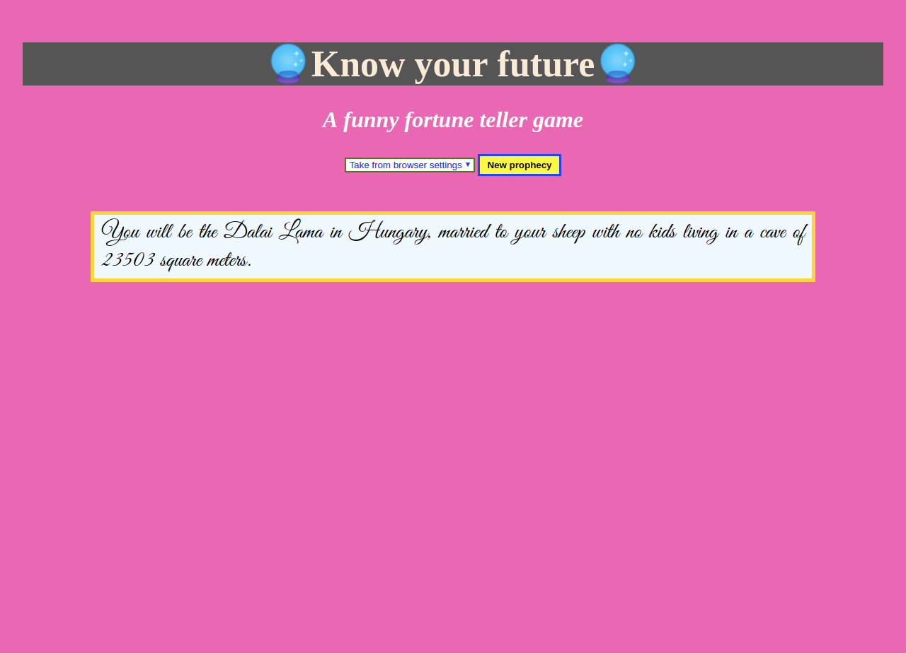
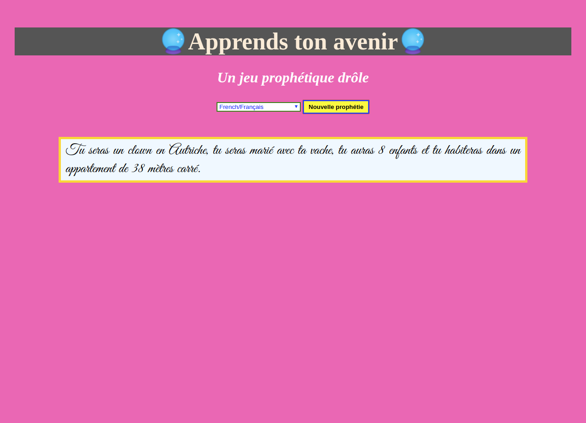
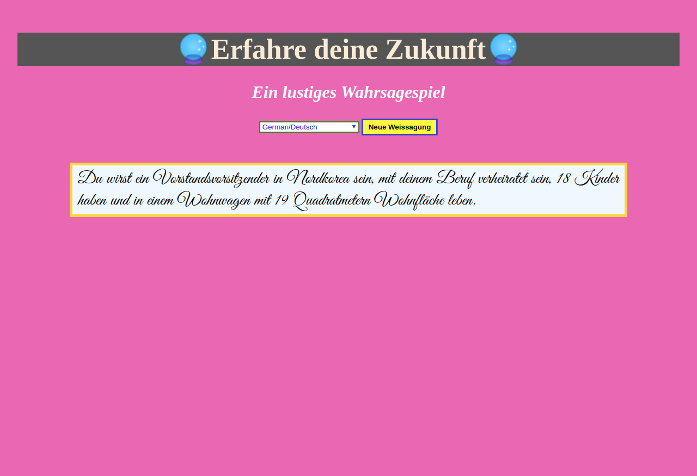
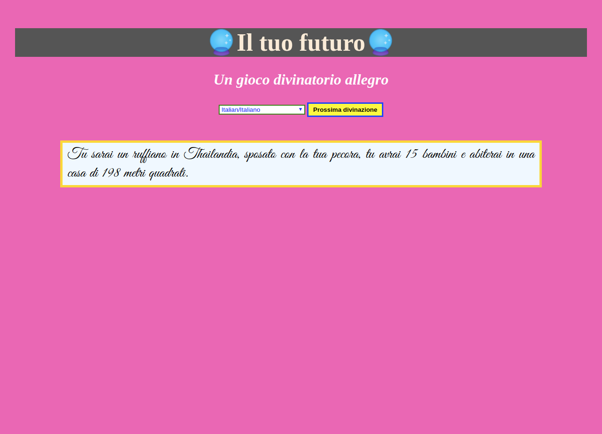
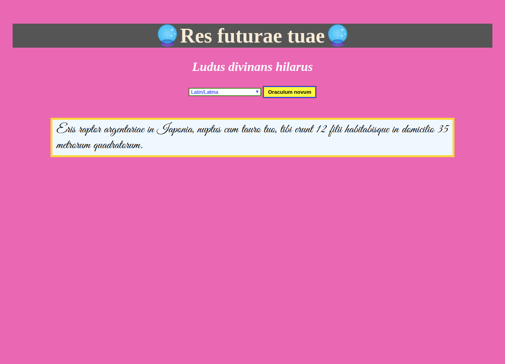

# fortune-js

This webpage was created by Stefan Klinkusch at Digital Career Institute in Berlin, Germany using vanilla JavaScript.

## Description

A fortune teller game in five languages (English, French, German, Italian, Latin) on a website, written in HTML, CSS, and JavaScript. Answers are completely random. There is no warranty, that you will like the fortune. If you don't like an answer, press the yellow button. Then, you will get a new fortune. Changing languages can be done using the dropdown menu; if you then press the yellow button, the next fortune will be in the desired language.

## Disclaimer

There is also no warranty, that the fortune will come true. 😁

## Screenshots
Screenshots are given for all available languages
### English

### French

### German

### Italian

### Latin
